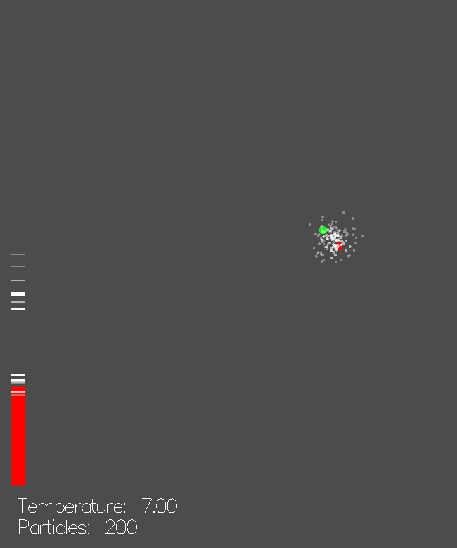

# Probability and programming

## Two views on probability

* Bayesian dogma: "Probability is a measure of __uncertainty__".
* Two computational interpretations of *random values*:
    1. Provide possible values on demand, in the frequency of their probability ("sampling")
    2. Given a value, say how probable it is ("probability distribution")

1. "Sampling"
    * `m a` (where `m` some special monad with "random" capability)
2. "Probability distribution"
    * `a -> Probability`

## `Class`es in `monad-bayes`

* Related type classes:
  ```haskell
  -- Trivia: Used to be called MonadSample
  class Monad m => MonadDistribution m where
    random :: m Double -- Between 0 and 1

  class Monad m => MonadFactor m where
    -- Log Double = Probability
    score :: Log Double -> m ()
  ```

* `instance MonadDistribution`: pseudorandom number generator
* `instance MonadFactor`: `Writer (Log Double)`

## Discrete probability monad

* Already known:
  ```haskell
  newtype Population a = Population [(a, Log Double)]
    deriving (Functor, Applicative, Monad)
  ```
* List several values together with their probability
* `Monad`: Concatenation/flatmap & multiply probabilities
  * (Essentially `WriterT (Log Double) [] a`)
* Sampling:
  ```haskell
  coinFlip = Population [(True, 0.5), (False, 0.5)]
  ```
* Distribution: Lookup value, return its probability
* Scoring: Multiply all probabilities

## Bayesian probability

"Probability is a measure of uncertainty."

* $\implies$ Knowledge changes probabilities!
* $p(x)$: Probability that event $x$ takes place
* $p(x | y)$: Probability that event $x$ takes place,
  given that $y$ definitely takes place

## Example

* $D$ result of a dice roll
* $p(D = 6) = 1/6$
* $p(D = 6 | D \text{ is even}) = 1/3$

## Bayesian inference

"How does the probability of $x$ change when we learn $y$?"

$$p(x | y) = \frac{p(y | x)}{p(y)} p(x)$$

* Think: Measure $y$, infer $x$!
* $p(x)$: "Prior", initial assumptions
* $p(y | x)$: "Likelihood", model
* $p(y | x) / p(y)$: "Score", "update"

## Example

* $D$ result of a dice roll
* $p(D = 6) = 1/6$
* $p(D \text{ is even}) = 1/2$
* $p(D \text{ is even} | D = 6) = 1$
* $p(D = 6 | D \text{ is even}) = \dots$
* $\dots = 1 / (1/2) * 1/6 = 1/3$

## Architecture of `monad-bayes`

* Compose monad stack from transformers that provide or lift `MonadDistribution` and `MonadFactor`
  * E.g. pseudo-random number generator, `IO` provide `MonadDistribution`
  * E.g. `PopulationT` provides `MonadFactor`
* Define prior & probabilistic model using `MonadDistribution`
* Use `MonadFactor` to score likelihood of observations
* Sampling & Inference = Interpretation/running of transformer layers

## Example (with minimal pseudocode)

```haskell
dieThrow :: MonadDistribution m => m Int
dieThrow = uniformD [1..6]

isEven :: MonadFactor m => m Int -> m Int
isEven value = do
  x <- value
  when (not $ even x) $ score 0
  return x

-- This will be 1/3
probabilitySix :: Log Double
probabilitySix = lookupPopulation 6
  $ normalize $ isEven dieThrow
```

# Functional reactive programming

## Idea & History

* React on *time-varying* values in a pure functional programming language
  * Robotics, games, web applications, UI, ...
* Classic FRP
  ```haskell
  type Signal a = Time -> a
  ```
* But: Hard to implement well, conceptually not focussed on *functions*
* Arrowized FRP
  ```haskell
  type SF a b = Signal a -> Signal b
  ```
* Restrict to causal signal functions, don't work with signals directly
* But: Pure core, side effects forbidden

## Quick intro to `dunai` & `rhine`

# Reactive probabilistic programming

## Stochastic processes

* A stochastic Markov-process consists of:
  * an internal state that may randomly vary, based on the previous state
  * an observable that randomly depends on the current state
* Final encoding:
  ```haskell
  data StochProc a = forall m . MonadDistribution m
    => StochProc (m (a, StochProc a))
  ```
* Isomorphic to:
  ```haskell
  forall m . MonadDistribution m => MSF m () a
  ```
* Example: Random walk with noisy sensor
  * State: Position
  * State update: Add a random translation to position
  * Sensor: Current position plus random noise

## Sequential Monte Carlo (Particle filters)

* Goal: Given observations, infer current state of a stochastic process
* Simulate a large number of copies of the process ("particles")
* Sample synthetic observations from particles
* Compare with measurements and `score` each particle
* Particle states with respective scores are a `Population` of states

## Online/Reactive machine learning

* Standard machine learning workflow:
  * Gather a bunch of data/observations
  * Run through e.g. SMC (see Control.Monad.Bayes.Inference.SMC)
  * *At the end*, look at final result
* But we want to react to results *as they appear*!
* Use current estimate to react
  * "Inference in the loop"
  * robotics, controllers, planning, user interaction, trading, ...

# `rhine-bayes`

## Signals a.k.a. behaviours

```haskell
type BehaviourF m time a b
  = forall cl. time ~ Time cl
  => ClSF m cl a b

type Behaviour m time b
  = BehaviourF m time () b
```

## Stochastic processes

* Signals + probabilistic side effects = stochastic processes
  ```haskell
  type StochasticProcess time a
    = forall m. (MonadDistribution m)
    => Behaviour m time a
  ```
* `time` can be `Double`, `UtcTime`, ...
* `rhine-bayes` contains standard library of stochastic processes
  * e.g. white noise, random walks, Poisson processes, ...

## Inference: Particle filters

```haskell
runPopulationCl ::
  forall m cl a b.
  (Monad m) =>
  -- | Number of particles
  Int ->
  -- | Resampler (see 'Control.Monad.Bayes.Population')
  (forall x. Population m x -> Population m x) ->
  -- | A signal function modelling the stochastic process
  --   on which to perform inference. @a@ represents
  --   observations upon which the model should condition,
  --   using e.g. 'score'. It can also additionally
  --   contain hyperparameters. @b@ is the type of
  --   estimated current state.
  ClSF (Population m) cl a b ->
  ClSF m cl a [(b, Log Double)]
```

## Integration: Clocks & signal networks

* Strength of `rhine`: Connect several independent systems safely
  * No clocking bugs (e.g. inference runs independently of graphics)
* Add machine learning component seamlessly to `gloss`, `terminal`, ... application

## Example

Blog post published today!

{ width=40% }

## Thanks!

* to Dominic Steinitz
* to Reuben Cohn-Gordon
* to Christopher Harrison & Mark Karpov for lots of great comments on the blog post
* for your attention & having me
* to all the Tweag folk, you're amazing!
